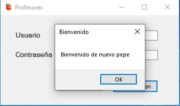
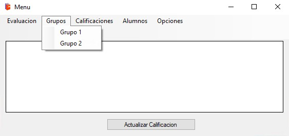
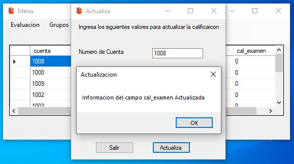

# Proyecto c# - Escuela

## Objetivo del proyecto.
1. Realizar una aplicación en c# que sea de utilidad en una escuela
1. Hacer que la aplicación logre conectarse a un servidor de Base de Datos (Punto extra)
1. Entregar la aplicación terminada y funcional

## Objetivo de la aplicación: 
+ Esta es una aplicación destinada a realizar un apoyo a la evaluación docente. 

## Características de la aplicación
1. La aplicación funciona tiene dos partes fundamentales
    1. Servidor Windows Server para almacenar de forma persistente las calificaciones de los alumnos.
    2. Aplicación para Windows
1. La aplicación crea automáticamente la Base de datos SQL y configura de forma automática su inicialización
    + Usuario inicial
    + Password
    + Permisos y buenas prácticas para la Base de Datos
1. La aplicación cuenta con un sistema de login
    + `user:pepe`
    + `password:hola123.,`
1. La aplicación respalda la información en una BD de manera inmediata

***

# Modo de uso

## Configuración de primera ejecución

1. La primera vez que se corre la aplicación creará la infraestructura necesaria para trabajar con la BD

2. Luego de ello permite la entrada a un sistema de _login_

3. Si es la primera vez permitirá configurar los parámetros de evaluación de la materia

4. Si es la primera vez permitirá configurar los parámetros de evaluación de la materia

## Inicio normal

1. La ventana principal tendrá tabs las cuales permitan manipular cada una de sus funciones:
    + Evaluación
    + Grupos
    + Alumnos
    + Calificaciones
    + Opciones

2. Evaluación

3. Grupos

4. Alumnos

5. Calificaciones. En este lugar podremos evaluar
    + Examenes
    + Proyectos
    + Tareas
    + Consultar la calificación final
    + Consultar todas las calificaciones

6. Créditos
    
